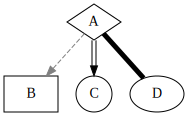
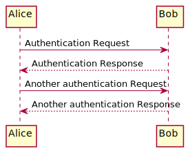

:toc:

= Example doc
Greg Hall

== Section 1

Paragraph of text

* Unordered 1
* Unordered 2

== Section 2

Ordered list

. Ordered 1
. Ordered 2

Try https://www.google.ca[Googling] it.

== Section 3

----
# Wipe out hard drive like an idiot
rm -rf /
----

== Section 4

Here is an image of a sunset

image::docs/readme/img/sunset.jpg["Mesa Verde Sunset, by JAVH"]

== Section 5

Here is a diagram generated by dot.

== Section 6

Diagram generated by ditaa.

image::docs/readme/img/memory.ditaa.svg["Memory"]

== Section 7

Diagram generated by plantuml.

